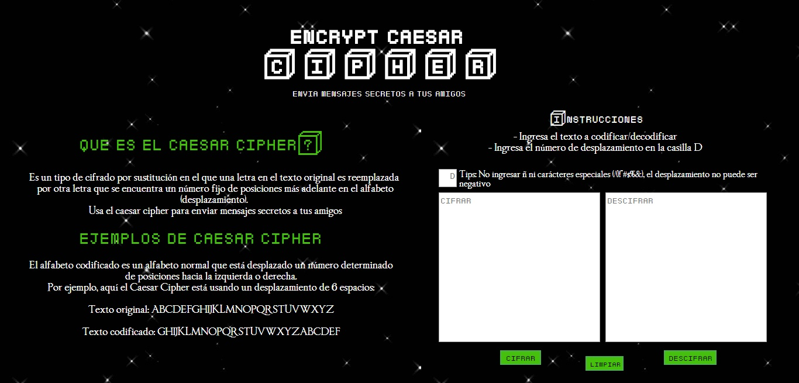
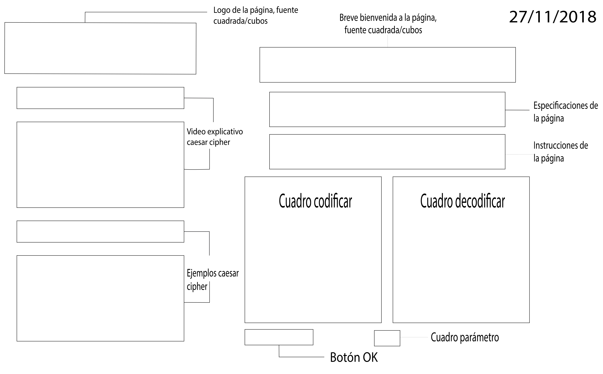
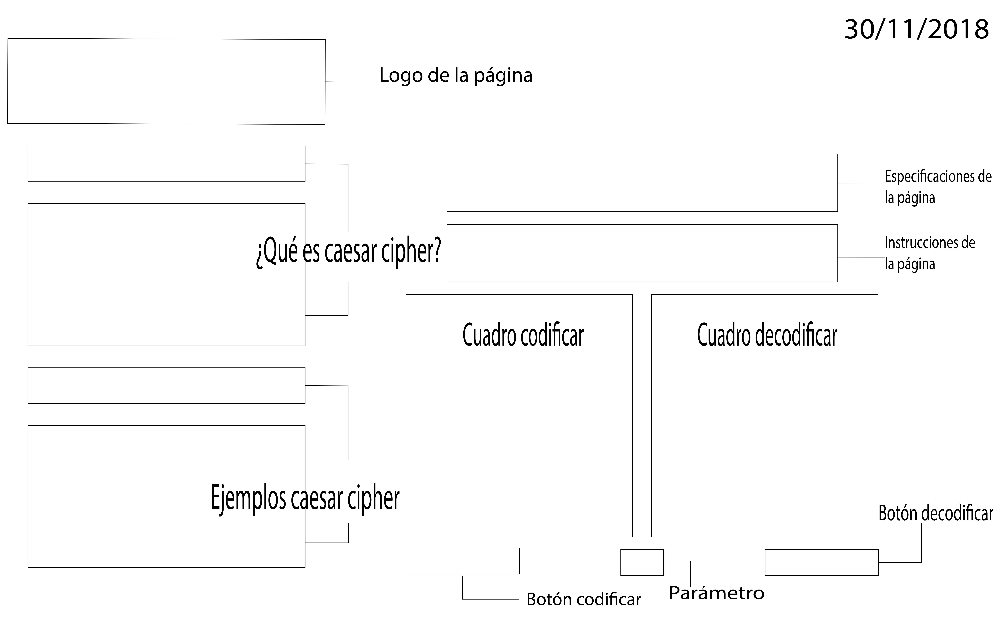

# Caesar Cipher

## Índice 

- Para el usuario
   - ¿Qué es el Caesar Cipher?
   - ¿Para qué usar Caesar Chipher?
   - Instrucciones de uso
- Para el desarrollador
   - Especificaciones
   - Objetivos de la página
   - Público objetivo
   - Evolución interfáz
   - Interfáz final

## Para el usuario

### **¿Qué es el Encrypt Caesar Cipher?**
- El Encrypt Caesar Cipher es una aplicación en base a una de las técnicas de cifrado más simples y usadas, el cifrado cesar. Este es un tipo de cifrado por sustitución en el que una letra del texto original es reemplazada por otra letra que se encuentra un número fijo de posiciones más adelante en el alfabeto. Nuestra página web se enfoca en niños y adolescentes entre 8 y 20 años amantes de los videojuegos. ¿Por qué este público? Porque notamos que suelen haber problemas para enviar mensajes mientras juegan o planean tácticas en juegos de mundo abierto con chat global. Mediante la aplicación nuestro público podrá enviar mensajes cifrados inentendibles que sólo podrán ser leídos por quien tenga la llave (desplazamiento).

### **¿Para qué usar Caesar Cipher?**
- Tan sencillo como pensar en querer enviar un mensaje que sólo tú y el destinatario entiendan. Puedes enviar desde frases hasta alternativas estratégicas secretas para algún juego en particular. Caesar chiper no tiene límites. 

### **Instrucciones de uso**
- Para **codificar:** Ingresa el texto a cifrar en el cuadro "cifrar", ingresa la llave o desplazamiento en la caja "D" y haz click en el botón "cifrar". El mensaje cifrado aparecerá en el cuadro del lado. 
- Para **descifrar:** Ingresa el texto a descifrar en el cuadro "descifrar", ingresa la llave o desplazamiento (debe ser la misma que se usó para cifrar) en el cuadro "D" y haz click en el botón "descifrar". El mensaje descifrado aparecerá en el cuadro del lado.

## Para el desarrollador

### **Especificaciones:**
- Caesar Cipher es un codificador/decodificar de mensajes mediante una llave (desplazamiento) secreta. 

### **Objetivos de la página:**
- Recibir y enviar mensajes secretos que sólo el receptor podrá decodificar mediante una llave (desplazamiento)
- Mantener en secreto conversaciones con amigos 

### **Público objetivo:**
- Caesar Cipher está pensado en niños y adolescentes amantes de los videojuegos de entre 8 y 20 años. La interfáz de la página se hizo pensando siempre en ellos. Los colores negro y verde de la página se hicieron en base a la película Matrix (ciencia ficción), las letras en el famoso juego Minecraft y el fondo Star Wars. La página es de fácil acceso y entendimiento. 

## **Envolución interfáz (sketch)** 

**Primer sketch (27-11):** ^ Se cambió la interfáz de la página ya que se encontró que era difícil de entender y visualmente cansador. Diseño poco entendible y saturado de información. 

**Segundo sketch (30-11):** ^ Se eliminó cuadro de video y bienvenida a la página (contenido distractor). Botones "cifrar" y "descifrar" se independizan.

**Tercer sketch (02-12):** Mayor protagonismo a cuadros codificar/decodificar. Se agrega botón "limpiar". El logo es centrado ya que de la otra forma se creaba un "vacío" un la esquina superior derecha. El parámetro cambia a una posición más accesible. 

## Interfáz final 

- Sencillo de usar. Tan solo una página de navegación. 3 botones funcionales (cifrar, limpiar, descifrar). En el lado izquierdo hay información sobre qué es el caesar cipher y ejemplos (esto para hacer más entendible la página para el usuario) en el lado derecho la parte funcional de la página. 

Planificación Trello: https://trello.com/b/JhlGMbJ1/cipher