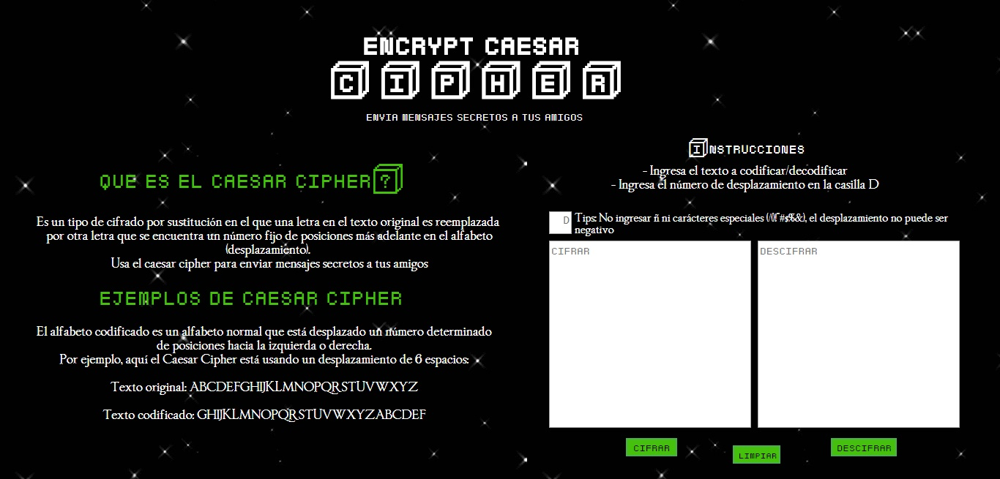
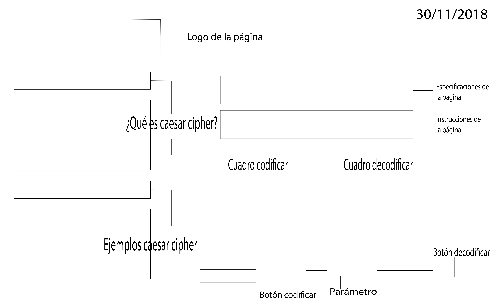
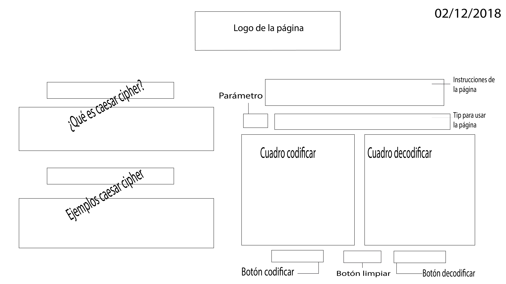

# Caesar Cipher

## Índice 

- [Especificaciones](#especificaciones)
- [Objetivos de la página](#Objetivosdelapágina)
- [Público objetivo](#públicoobjetivo)
- []
- [Evolución interfáz](#evolucióninterfáz)

### **Especificaciones:**
- Caesar Cipher es un codificador/decodificar de mensajes mediante una llave (desplazamiento) secreta. 

### **Objetivos de la página:**
- Recibir y enviar mensajes secretos que sólo el receptor podrá decodificar mediante una llave (desplazamiento)
- Mantener en secreto conversaciones con amigos 

### **Público objetivo:**
- Caesar Cipher está pensado en niños y adolescentes amantes de los videojuegos de entre 8 y 20 años. La interfáz de la página se hizo pensando siempre en ellos. Los colores negro y verde de la página se hicieron en base a la película Matrix (ciencia ficción), las letras en el famoso juego Minecraft y el fondo Star Wars. La página es de fácil acceso y entendimiento. 

## **Envolución interfáz (sketch)** 

**Primer sketch (27-11):** ^ Se cambió la interfáz de la página ya que se encontró que era difícil de entender y visualmente cansador. Diseño poco entendible y saturado de información. 

**Segundo sketch (30-11):** ^ Se eliminó cuadro de video y bienvenida a la página (contenido distractor). Botones "cifrar" y "descifrar" se independizan.

**Tercer sketch (02-12):** Mayor protagonismo a cuadros codificar/decodificar. Se agrega botón "limpiar". El logo es centrado ya que de la otra forma se creaba un "vacío" un la esquina superior derecha. El parámetro cambia a una posición más accesible. 